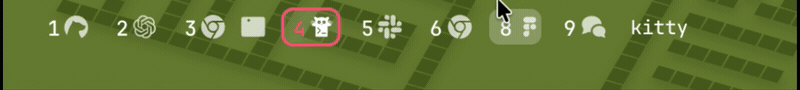
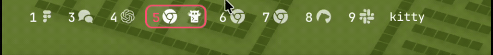

# SketchyBar Toggle

A lightweight macOS daemon that coordinates between [SketchyBar](https://github.com/FelixKratz/SketchyBar) and the native macOS menu bar.

## The Problem

If you use SketchyBar with the native macOS menu bar set to "auto-hide," both bars fight for the same space at the top of the screen. When you move your mouse up to reveal the native menu bar, it slides down *over* SketchyBar, creating an ugly overlap. There's no built-in way to coordinate them.

<p align="center">
  
  <br>
  <em>Without SketchyBar Toggle: the native menu bar drops down on top of SketchyBar</em>
</p>

## The Solution

SketchyBar Toggle watches your mouse position and coordinates the two bars:

1. **Mouse approaches the top of the screen** — hides SketchyBar so the native menu bar can appear cleanly
2. **Mouse moves away from the top** — slides SketchyBar back into view

The result: you get SketchyBar as your primary status bar, with seamless access to the native menu bar whenever you need it. The two never overlap.

<p align="center">
  
  <br>
  <em>With SketchyBar Toggle: SketchyBar hides as the menu bar appears, then slides back into view</em>
</p>

## Prerequisites

1. **[SketchyBar](https://github.com/FelixKratz/SketchyBar)** installed and running
2. **SketchyBar `topmost` set to `"window"`** — this ensures SketchyBar renders above the macOS menu bar. Without it, SketchyBar will render behind the menu bar and appear invisible even when sketchybar-toggle shows it.

   In your SketchyBar config (Lua):
   ```lua
   sbar.bar({ topmost = "window", ... })
   ```

   Or shell-based `sketchybarrc`:
   ```bash
   sketchybar --bar topmost=window
   ```

3. **macOS menu bar set to auto-hide**: System Settings > Control Center > "Automatically hide and show the menu bar" > select "Always" or "In Full Screen Only"

   > **Tip:** After changing the auto-hide setting, you may need to run `killall Dock` for it to take effect.

## Install

### Homebrew (recommended)

```bash
brew install malpern/tap/sketchybar-toggle
```

### Build from source

```bash
git clone https://github.com/malpern/sketchybar-toggle.git
cd sketchybar-toggle
swift build -c release
```

Then copy the binary somewhere on your PATH:

```bash
# Apple Silicon (default Homebrew prefix)
cp .build/release/sketchybar-toggle /opt/homebrew/bin/

# Or Intel Mac
cp .build/release/sketchybar-toggle /usr/local/bin/
```

Requires Swift 5.9+ and macOS 13 (Ventura) or later.

### Grant Input Monitoring permission

SketchyBar Toggle needs **Input Monitoring** permission to track mouse position:

1. Run `sketchybar-toggle` — macOS will prompt you to grant permission, or it will print an error
2. Go to **System Settings > Privacy & Security > Input Monitoring**
3. Add and enable the `sketchybar-toggle` binary
4. Restart sketchybar-toggle after granting permission

You can verify with `sketchybar-toggle --check-permissions`.

## SketchyBar Configuration

SketchyBar Toggle works best when your SketchyBar bar settings allow for smooth hide/show transitions. SketchyBar Toggle controls your bar using:

- `sketchybar --bar hidden=on` — to hide
- `sketchybar --bar hidden=off y_offset=-50` followed by `sketchybar --animate sin 12 --bar y_offset=0` — to show with a slide-down animation

### Required: `topmost = "window"`

Your SketchyBar config **must** include `topmost = "window"`. This tells SketchyBar to render above the native macOS menu bar. Without it, SketchyBar renders behind the menu bar and will appear invisible even when sketchybar-toggle un-hides it.

```lua
-- In your bar config (e.g., bar.lua or init.lua)
sbar.bar({ topmost = "window", ... })
```

### Optional: transparent bar style

If you want your SketchyBar to visually match the native macOS menu bar (transparent background, no borders), here's an example bar config:

```lua
-- bar.lua
sbar.bar({
  topmost = "window",  -- REQUIRED for sketchybar-toggle
  height = 35,
  margin = 0,
  y_offset = 0,
  corner_radius = 0,
  color = 0x00000000,  -- fully transparent
  blur_radius = 0,
  border_width = 0,
})
```

And remove borders from the default item style:

```lua
-- default.lua (background section)
background = {
  height = 28,
  corner_radius = 5,
  border_width = 0,
  border_color = 0x00000000,
  color = 0x00000000,
},
```

## Auto-start

### Quick setup

Run `sketchybar-toggle --setup` to detect your SketchyBar config format and get the exact line to add:

```bash
sketchybar-toggle --setup
```

### Recommended: launch from SketchyBar's config

The simplest way to auto-start sketchybar-toggle is to launch it from your SketchyBar config. This way it starts and stops with SketchyBar.

If you use a **Lua config** (`sketchybarrc` calls into Lua), add this to your `init.lua` or `sketchybarrc`:

```lua
-- Kill any existing instance, then start sketchybar-toggle in the background
sbar.exec("pkill -x sketchybar-toggle; sketchybar-toggle &")
```

If you use a **shell-based** `sketchybarrc`:

```bash
# Start sketchybar-toggle alongside SketchyBar
pkill -x sketchybar-toggle
sketchybar-toggle &
```

### Alternative: launchd plist

If you prefer sketchybar-toggle to run independently (e.g., start at login regardless of SketchyBar), copy the included plist:

```bash
cp com.sketchybar-toggle.agent.plist ~/Library/LaunchAgents/
launchctl load ~/Library/LaunchAgents/com.sketchybar-toggle.agent.plist
```

> **Note:** Edit the plist if your binary isn't at `/usr/local/bin/sketchybar-toggle` — update the path in `ProgramArguments`.

To stop:

```bash
launchctl unload ~/Library/LaunchAgents/com.sketchybar-toggle.agent.plist
```

Logs are written to `/tmp/sketchybar-toggle.log`.

## Usage

```bash
# Run with defaults
sketchybar-toggle

# Custom thresholds
sketchybar-toggle --trigger-zone 10 --menu-bar-height 50 --debounce 150

# Show auto-start setup instructions
sketchybar-toggle --setup

# Check permissions
sketchybar-toggle --check-permissions

# Print version
sketchybar-toggle --version
```

### Options

| Flag | Default | Description |
|------|---------|-------------|
| `--trigger-zone <px>` | 10 | Distance from top of screen (in pixels) that triggers SketchyBar to hide |
| `--menu-bar-height <px>` | 50 | Distance from top defining the menu bar zone — SketchyBar won't reappear until the mouse is below this |
| `--debounce <ms>` | 150 | Delay in milliseconds before SketchyBar reappears, prevents flicker on rapid mouse movement |
| `--setup` | | Check prerequisites and show auto-start instructions |
| `--check-permissions` | | Check if Input Monitoring permission is granted |
| `--version` | | Print version |
| `--help` | | Show help |

### Tuning tips

- **SketchyBar hides too late** (you see overlap): decrease `--trigger-zone` (e.g., `--trigger-zone 5`)
- **SketchyBar hides when you don't want it to**: increase `--trigger-zone`
- **SketchyBar reappears while the menu bar is still visible**: increase `--menu-bar-height` (e.g., `--menu-bar-height 60`)
- **Transitions feel slow**: decrease `--debounce` (e.g., `--debounce 100`)
- **Flickering on rapid mouse movement**: increase `--debounce`

## Troubleshooting

**SketchyBar doesn't appear / renders behind the menu bar**
Your SketchyBar config is missing `topmost = "window"`. Add it to your bar settings and restart SketchyBar (`brew services restart sketchybar`). See [Prerequisites](#prerequisites).

**Menu bar auto-hide setting doesn't take effect**
After changing "Automatically hide and show the menu bar" in System Settings, run `killall Dock` to force macOS to apply the change immediately.

**sketchybar-toggle is running but nothing happens**
Run `sketchybar-toggle --setup` to check prerequisites. The most common cause is a missing `topmost = "window"` setting in SketchyBar.

**SketchyBar stays hidden after sketchybar-toggle crashes or is force-killed**
Run `sketchybar --bar hidden=off` to restore it manually. Under normal shutdown (Ctrl+C or SIGTERM), sketchybar-toggle restores SketchyBar automatically.

## How It Works

SketchyBar Toggle uses a passive [CGEventTap](https://developer.apple.com/documentation/coregraphics/cgevent) to monitor mouse movement at the Core Graphics level. This is event-driven (zero CPU when the mouse isn't moving) and works globally across all apps, including fullscreen.

The core logic is a simple state machine:

```
SKETCHYBAR_VISIBLE (default)
  → mouse enters trigger zone (top 10px)
  → hide SketchyBar instantly

SKETCHYBAR_HIDDEN
  → mouse leaves menu bar zone (below 50px)
  → wait for debounce (150ms)
  → slide SketchyBar back into view
```

SketchyBar Toggle controls SketchyBar via its CLI (`sketchybar --bar hidden=on/off`) and uses SketchyBar's built-in animation system for smooth slide-down transitions.

On startup, sketchybar-toggle restores SketchyBar to visible (in case a previous instance crashed with the bar hidden). On SIGTERM/SIGINT (Ctrl+C or `kill`), it restores visibility before exiting.

## Architecture

```
sketchybar-toggle/
├── Package.swift
├── Sources/
│   ├── SketchyBarToggleCore/              # Library — all testable logic
│   │   ├── BarController.swift            # Protocol for bar control (enables mocking)
│   │   ├── StateMachine.swift             # State machine: visible ↔ hidden with debounce
│   │   ├── EventTap.swift                 # CGEventTap setup + screen geometry
│   │   ├── SketchyBarController.swift     # Shells out to sketchybar CLI
│   │   ├── PrerequisiteChecker.swift      # Verifies topmost, menu bar auto-hide
│   │   └── Config.swift                   # CLI argument parsing
│   └── SketchyBarToggle/
│       └── main.swift                     # Entry point, signal handlers, run loop
├── Tests/
│   └── SketchyBarToggleTests/             # Unit tests
├── com.sketchybar-toggle.agent.plist      # launchd plist for auto-start
└── README.md
```

## Requirements

- macOS 13+ (Ventura)
- [SketchyBar](https://github.com/FelixKratz/SketchyBar)
- Swift 5.9+ (build only)
- No runtime dependencies — uses only system frameworks (CoreGraphics, AppKit, Foundation)

## License

MIT
